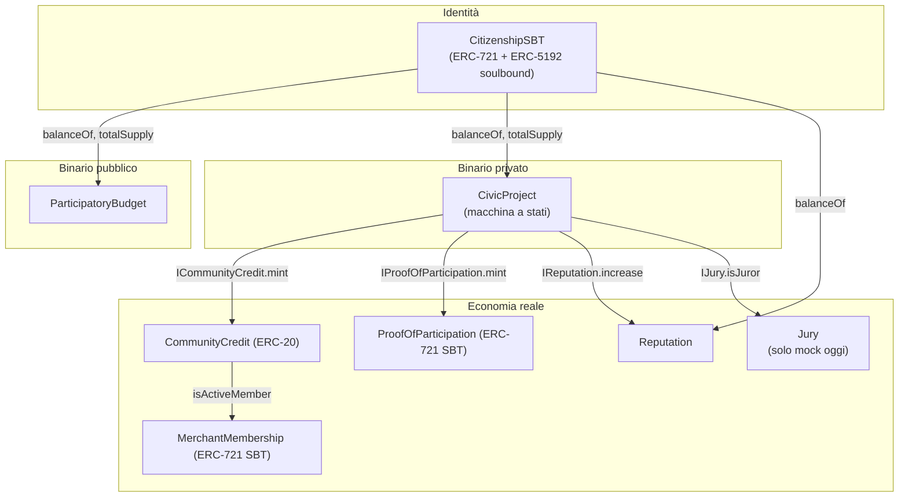
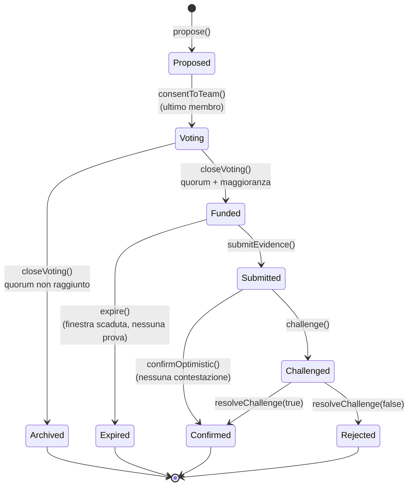
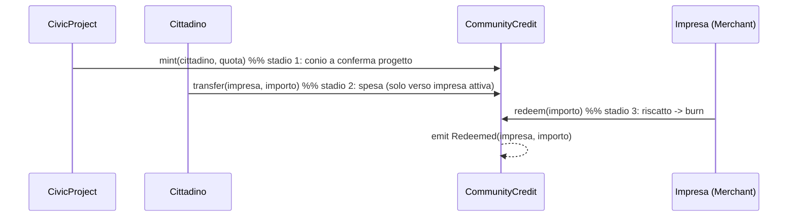
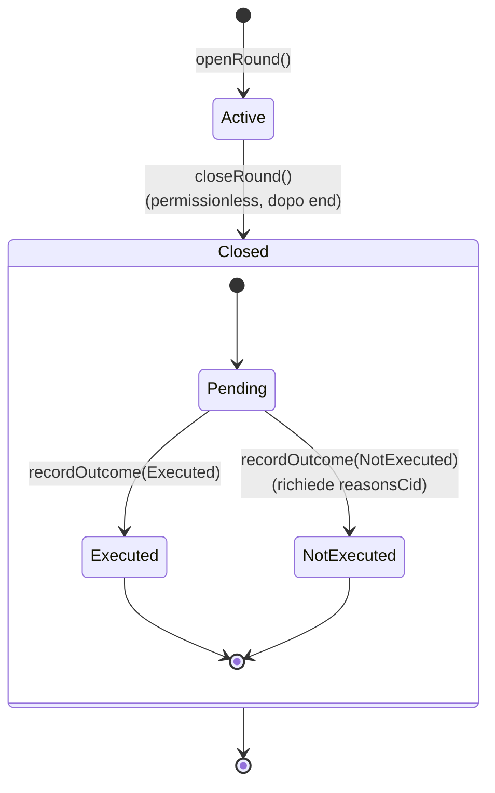
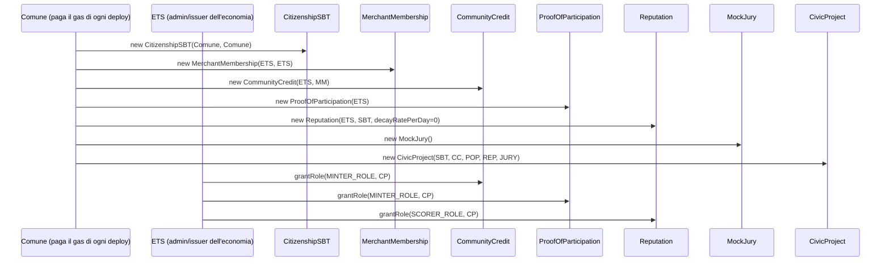

# Architettura degli Smart Contract — CivicDAO

> Documento che descrive gli
> smart contract presenti in `src/` (Solidity ^0.8.20,
> compilato con solc 0.8.28 via Foundry; OpenZeppelin v5.1.0), le sue
> responsabilità, le funzioni principali con i relativi snippet.

## Indice

- [Architettura degli Smart Contract — CivicDAO](#architettura-degli-smart-contract--civicdao)
  - [Indice](#indice)
  - [1. Panoramica e principi di design](#1-panoramica-e-principi-di-design)
  - [2. Struttura del repository](#2-struttura-del-repository)
  - [3. Grafo delle dipendenze tra contratti](#3-grafo-delle-dipendenze-tra-contratti)
  - [4. CitizenshipSBT — identità digitale soulbound](#4-citizenshipsbt--identità-digitale-soulbound)
    - [4.1 Ruoli e stato](#41-ruoli-e-stato)
    - [4.2 `mintWithAuth` — onboarding autorizzato dal Comune](#42-mintwithauth--onboarding-autorizzato-dal-comune)
    - [4.3 Soulbound-ness (`_update`)](#43-soulbound-ness-_update)
    - [4.4 `totalSupply()` come snapshot dell'elettorato](#44-totalsupply-come-snapshot-dellelettorato)
  - [5. CivicProject — binario privato (macchina a stati)](#5-civicproject--binario-privato-macchina-a-stati)
    - [5.1 Macchina a stati](#51-macchina-a-stati)
    - [5.2 Struct e costanti principali](#52-struct-e-costanti-principali)
    - [5.3 Proposta e consenso vincolante del team](#53-proposta-e-consenso-vincolante-del-team)
    - [5.4 Voto e chiusura](#54-voto-e-chiusura)
    - [5.5 Verifica ottimistica, contestazione e giuria](#55-verifica-ottimistica-contestazione-e-giuria)
    - [5.6 `_settle` — gli effetti della conferma (punto cruciale per la tesi, sez. 4.4.2 punto 8)](#56-_settle--gli-effetti-della-conferma-punto-cruciale-per-la-tesi-sez-442-punto-8)
  - [6. Interfacce di frontiera verso l'economia](#6-interfacce-di-frontiera-verso-leconomia)
  - [7. CommunityCredit — credito comunitario (ERC-20)](#7-communitycredit--credito-comunitario-erc-20)
    - [7.1 Circuito chiuso a tre stadi](#71-circuito-chiuso-a-tre-stadi)
    - [7.2 `mint` e `_update`: il vincolo di destinazione](#72-mint-e-_update-il-vincolo-di-destinazione)
    - [7.3 `redeem` — chiusura del circuito](#73-redeem--chiusura-del-circuito)
  - [8. MerchantMembership — iscrizione annuale imprese](#8-merchantmembership--iscrizione-annuale-imprese)
  - [9. ProofOfParticipation — badge di partecipazione (ERC-721)](#9-proofofparticipation--badge-di-partecipazione-erc-721)
  - [10. Reputation — reputazione non trasferibile](#10-reputation--reputazione-non-trasferibile)
    - [10.1 Decadimento lazy (pull, non push)](#101-decadimento-lazy-pull-non-push)
    - [10.2 `increase`: cristallizzazione del decay prima della scrittura](#102-increase-cristallizzazione-del-decay-prima-della-scrittura)
    - [10.3 Soglia per ruoli funzionali](#103-soglia-per-ruoli-funzionali)
  - [11. ParticipatoryBudget — binario pubblico (Quadratic Voting)](#11-participatorybudget--binario-pubblico-quadratic-voting)
    - [11.1 Ruoli e struct](#111-ruoli-e-struct)
    - [11.2 Macchina a stati: Round e Outcome](#112-macchina-a-stati-round-e-outcome)
    - [11.3 Apertura round: registrazione atomica dello slate](#113-apertura-round-registrazione-atomica-dello-slate)
    - [11.4 `castVotes`: voto quadratico, un cittadino un voto (nel senso di "una scheda")](#114-castvotes-voto-quadratico-un-cittadino-un-voto-nel-senso-di-una-scheda)
    - [11.5 Chiusura permissionless e quorum senza arrotondamento](#115-chiusura-permissionless-e-quorum-senza-arrotondamento)
    - [11.6 `recordOutcome` — obbligo di motivazione codificato](#116-recordoutcome--obbligo-di-motivazione-codificato)
  - [12. Deploy e risoluzione della dipendenza circolare](#12-deploy-e-risoluzione-della-dipendenza-circolare)
  - [13. Componenti previste ma non ancora implementate](#13-componenti-previste-ma-non-ancora-implementate)

---

## 1. Panoramica e principi di design

Il sistema implementa due "binari" di governance della CivicDAO, entrambi
ancorati alla stessa identità digitale (`CitizenshipSBT`):

- **Binario pubblico** (`ParticipatoryBudget`): bilancio partecipativo a voto
  quadratico su uno slate di proposte già selezionate dal Comune off-chain. Il contratto **attesta** punteggi ed esito, non decide e non
  muove fondi.
- **Binario privato** (`CivicProject`): macchina a stati che governa l'intero
  ciclo di vita di un progetto civico interno alla DAO, dalla proposta alla
  conferma o al rigetto, collegata a un'economia di incentivi
  reale (`CommunityCredit`, `ProofOfParticipation`, `Reputation`).

Tre principi architetturali ricorrono in tutti i contratti e vale la pena
enunciarli una volta sola nel capitolo di implementazione:

1. **Separazione governance / economia tramite interfacce di frontiera.**
   `CivicProject` non importa mai un'implementazione concreta dell'economia:
   dipende solo da `ICommunityCredit`, `IProofOfParticipation`, `IReputation`,
   `IJury` (cartella `src/interfaces/`). Governance comanda, economia esegue.
   Questo permette di sostituire un mock con l'implementazione reale (vedi
   `demo-privato.sh`, §12) senza toccare una riga di `CivicProject`.
2. **Nessun valore economico reale on-chain.** Sia il budget in euro dei
   progetti civici (`CivicProject`) sia la quota di iscrizione delle imprese
   (`MerchantMembership`) sono pagamenti **off-chain**. La catena registra
   solo il *fatto* (evento) che l'operazione è avvenuta, mai il denaro stesso.
   Il "circuito chiuso" del community credit (conio → spesa → redeem/burn) è
   l'unico controvalore realmente tokenizzato ed è per costruzione un token
   *interno* alla DAO.
3. **Soulbound come primitiva ricorrente.** Tre contratti su sette
   (`CitizenshipSBT`, `MerchantMembership`, `ProofOfParticipation`) sono
   token ERC-721 non trasferibili: tutti condividono lo stesso pattern,
   ovvero un override di `_update` che permette solo `from == address(0)`
   (mint) e fa revert su qualunque trasferimento.

Nessun contratto tocca `msg.value`/ether: l'intero flusso di valore descritto
nella tesi è, deliberatamente, o token interni (community credit) o eventi
puramente informativi (rimborsi in euro, iscrizioni imprese).

---

## 2. Struttura del repository

```
src/
  CitizenshipSBT.sol         # identità soulbound (ERC-5192), onboarding EIP-712
  CivicProject.sol           # binario privato: macchina a stati del progetto civico
  CommunityCredit.sol        # economia reale: credito comunitario (ERC-20)
  ProofOfParticipation.sol   # economia reale: badge PoP (ERC-721 soulbound)
  MerchantMembership.sol     # iscrizione annuale imprese (ERC-721 soulbound)
  Reputation.sol             # economia reale: reputazione non trasferibile, decay lazy
  ParticipatoryBudget.sol    # binario pubblico: voto quadratico, quorum, esito motivato
  interfaces/
    IERC5192.sol             # standard minimo di soulbound-ness
    ICommunityCredit.sol     # frontiera verso il credito comunitario
    IProofOfParticipation.sol
    IReputation.sol
    IJury.sol                # frontiera verso la giuria (solo mock, oggi)
test/
  ...                        # una suite per contratto + 2 di integrazione
```

...
## 3. Grafo delle dipendenze tra contratti



Nota di lettura: le frecce da `CivicProject` verso l'economia passano sempre
per un'interfaccia (etichetta sulla freccia), mai per un tipo concreto.

---

## 4. CitizenshipSBT — identità digitale soulbound

**File:** [CitizenshipSBT.sol](src/CitizenshipSBT.sol) · **Standard:** ERC-721 + [ERC-5192](https://eips.ethereum.org/EIPS/eip-5192) (soulbound) + EIP-712 · **Tesi:** sez. 5.4

È il fondamento di identità su cui poggiano sia il binario pubblico
(elettorato di `ParticipatoryBudget`) sia il binario privato (cittadinanza
richiesta da `CivicProject` e `Reputation`). 
Il conio richiede una firma EIP-712 del Comune (`ISSUER_ROLE`) .
Un solo token per residente, non trasferibile, senza revoca.

### 4.1 Ruoli e stato

```solidity
bytes32 public constant ISSUER_ROLE = keccak256("ISSUER_ROLE");

bytes32 public constant MINT_AUTH_TYPEHASH =
    keccak256("MintAuth(address addressTo,bytes32 nullifier,uint256 deadline)");

mapping(bytes32 => bool) public nullifierUsed;   // anti-replay
uint256 private _totalSupply;                     // mint - burn, usato da ParticipatoryBudget
```

### 4.2 `mintWithAuth` — onboarding autorizzato dal Comune

Chiunque può inviare la transazione (compatibile con relayer gasless): la
legittimità dipende dalla firma, non dal mittente. Quattro controlli in
sequenza, ciascuno con un errore dedicato:

```solidity
function mintWithAuth(
    address addressTo,
    bytes32 nullifier,
    uint256 deadline,
    bytes calldata sig
) external {
    if (block.timestamp > deadline) revert DeadlineExpired();               // (a) validità temporale

    bytes32 digest = hashMintAuth(addressTo, nullifier, deadline);           // (b) autenticità firma
    address signer = ECDSA.recover(digest, sig);
    if (!hasRole(ISSUER_ROLE, signer)) revert InvalidIssuerSignature();

    if (nullifierUsed[nullifier]) revert NullifierAlreadyUsed();            // (c) anti-replay
    if (balanceOf(addressTo) != 0) revert AlreadyCitizen();                 // (d) un token a testa

    nullifierUsed[nullifier] = true;
    uint256 tokenId = _nextId++;
    _mint(addressTo, tokenId);

    emit Locked(tokenId);                         // ERC-5192: soulbound per sempre
    emit CitizenshipMinted(addressTo, tokenId, nullifier);
}
```

Il digest EIP-712 è esposto come funzione pubblica (`hashMintAuth`), così il
Comune può firmarlo off-chain con il proprio wallet:

```solidity
function hashMintAuth(address addressTo, bytes32 nullifier, uint256 deadline)
    public view returns (bytes32)
{
    return _hashTypedDataV4(
        keccak256(abi.encode(MINT_AUTH_TYPEHASH, addressTo, nullifier, deadline))
    );
}
```

### 4.3 Soulbound-ness (`_update`)

Un solo choke point (pattern OZ v5) governa mint, burn e transfer:

```solidity
function _update(address to, uint256 tokenId, address auth) internal override returns (address) {
    address from = _ownerOf(tokenId);
    if (from != address(0) && to != address(0)) revert NonTransferable();
    if (from == address(0)) _totalSupply++;        // mint
    else if (to == address(0)) _totalSupply--;      // burn (nessuna funzione lo invoca oggi)
    return super._update(to, tokenId, auth);
}
```

Non esiste alcuna funzione di burn/revoca nel contratto: la cittadinanza,
una volta coniata, è **definitiva**.

### 4.4 `totalSupply()` come snapshot dell'elettorato

Esposta perché sia `ParticipatoryBudget`  sia
`CivicProject` (all'apertura della votazione, in `consentToTeam`) la
usano per fissare lo snapshot dell'elettorato con cui calcolano il quorum
come percentuale (10% in entrambi i casi).

---

## 5. CivicProject — binario privato (macchina a stati)

**File:** [CivicProject.sol](src/CivicProject.sol)

Governa l'intero ciclo di vita di un progetto civico. Non eredita
`AccessControl`: ogni transizione è gated da un controllo puntuale
(`balanceOf` per i cittadini, mapping di team/consenso per il team,
`IJury.isJuror` per la giuria) o è permissionless una volta scaduta la
relativa finestra temporale, nessun singolo attore può bloccare il flusso.

### 5.1 Macchina a stati



Da notare per il capitolo di implementazione: non esiste una fase di
Discussion/TeamFormation on-chain distinta — il primo passo dopo `propose`
è la raccolta del **consenso vincolante** del team (`consentToTeam`), che
apre automaticamente la votazione al raggiungimento dell'ultimo consenso.

### 5.2 Struct e costanti principali

```solidity
struct Project {
    address proposer;
    string description;
    address[] team;
    uint256 creditAllocation;      // community credit riservato ai performer
    uint256 budgetEuro;            // stima di costo dichiarata dal proponente, solo
                                    // informativa per il voto: mai pagata/verificata
                                   
    uint64 verificationWindow;     // finestra di contestazione ottimistica
    uint64 executionWindow;        // finestra per presentare le prove
    Status status;
    uint256 consentCount;
    uint64 votingEnd;
    uint256 electorate;            // CitizenshipSBT.totalSupply() snapshot preso
                                    // all'apertura della votazione 
    uint256 votesFor;
    uint256 votesAgainst;
    uint256 voterCount;
    uint64 fundedAt;
    uint64 executionDeadline;
    string evidenceIpfsHash;
    address[] performers;          // sottoinsieme del team che ha davvero lavorato
    uint64 verificationDeadline;
}

uint64  public constant DEFAULT_VERIFICATION_WINDOW = 7 days;
uint64  public constant DEFAULT_EXECUTION_WINDOW = 30 days;
uint64  public constant VOTING_DURATION = 3 days;
uint256 public constant QUORUM_BPS = 1_000;           // 10%, identico a ParticipatoryBudget.QUORUM_BPS
uint256 public constant BPS_DENOMINATOR = 10_000;
uint256 public constant REPUTATION_INCREMENT = 120;   // incremento uguale per ogni performer
```

Il quorum è, come nel binario pubblico, una percentuale (10%) dello snapshot
dell'elettorato preso all'apertura della votazione. Il valore di
`REPUTATION_INCREMENT` è 120 che dà una
finestra per il decadimento a 0 della reputazione di circa 4 mesi. Nella repo attuale, però, nessun deploy usa
quel valore: `demo-privato.sh` (§12) deploya `Reputation` con
`decayRatePerDay = 0` (dichiarato esplicitamente a terminale), quindi senza
alcun decadimento in quella demo.

### 5.3 Proposta e consenso vincolante del team

```solidity
function propose(
    string calldata description,
    address[] calldata team,
    uint256 creditAllocation,
    uint256 budgetEuro,          // stima informativa, mai pagata/verificata on-chain
    uint64 verificationWindow,
    uint64 executionWindow
) external returns (uint256 projectId) {
    if (citizenship.balanceOf(msg.sender) == 0) revert NotCitizen();
    if (team.length == 0) revert EmptyTeam();
    // ... registra il progetto, verifica che ogni membro del team sia cittadino
    // e che non compaia due volte (DuplicateTeamMember)
}

function consentToTeam(uint256 projectId) external {
    Project storage p = _getProject(projectId);
    if (p.status != Status.Proposed) revert InvalidStatus();
    if (!isTeamMember[projectId][msg.sender]) revert NotTeamMember();
    if (hasConsented[projectId][msg.sender]) revert AlreadyConsented();

    hasConsented[projectId][msg.sender] = true;
    p.consentCount++;
    emit TeamConsentGiven(projectId, msg.sender);

    if (p.consentCount == p.team.length) {          // auto-avanzamento
        p.status = Status.Voting;
        p.votingEnd = uint64(block.timestamp) + VOTING_DURATION;
        p.electorate = citizenship.totalSupply();   // snapshot per il quorum, come in ParticipatoryBudget.openRound
        emit VotingOpened(projectId, p.votingEnd);
    }
}
```

La community vota solo su un team che ha già dato consenso vincolante
on-chain.

### 5.4 Voto e chiusura

```solidity
function vote(uint256 projectId, bool support) external {
    // one-person-one-vote: balanceOf > 0, hasVoted mapping, nessun peso reputazionale
}

function closeVoting(uint256 projectId) external {
    Project storage p = _getProject(projectId);
    if (p.status != Status.Voting) revert InvalidStatus();
    if (block.timestamp <= p.votingEnd) revert VotingStillOpen();

    bool quorumReached = p.voterCount * BPS_DENOMINATOR >= p.electorate * QUORUM_BPS;
    bool approved = quorumReached && p.votesFor > p.votesAgainst;
    if (approved) {
        p.status = Status.Funded;
        p.fundedAt = uint64(block.timestamp);
        p.executionDeadline = p.fundedAt + p.executionWindow;
        emit ProjectFunded(projectId, p.executionDeadline);
    } else {
        p.status = Status.Archived;
        emit ProjectArchived(projectId);
    }
}
```

`closeVoting` è **permissionless**: chiunque può chiuderla dopo la
scadenza, evitando che un singolo attore blocchi il flusso rifiutandosi di
farlo (stesso principio adottato in `ParticipatoryBudget.closeRound`).
Il calcolo del quorum è la stessa formula in basis point, senza divisione
(per evitare arrotondamenti), usata da `ParticipatoryBudget.closeRound`
A differenza del binario pubblico, però, qui l'esito è
**vincolante**: mancare il quorum manda il progetto ad `Archived` invece di
limitarsi ad attestare il fatto accanto a una chiusura incondizionata.
Nota: `Funded` è solo un flag, nessun euro si muove on-chain.

### 5.5 Verifica ottimistica, contestazione e giuria

```solidity
function submitEvidence(uint256 projectId, string calldata ipfsHash, address[] calldata performers) external {
    // solo un membro del team, solo in stato Funded, entro executionDeadline;
    // `performers` (sottoinsieme del team) diventa la base di riparto del conio
}

function challenge(uint256 projectId) external {
    // qualunque cittadino, entro verificationDeadline -> Status.Challenged
}

function confirmOptimistic(uint256 projectId) external {
    // chiunque, dopo verificationDeadline, se nessuno ha contestato -> _settle()
}

function resolveChallenge(uint256 projectId, bool approve) external {
    if (!jury.isJuror(msg.sender)) revert NotJuror();
    if (approve) _settle(projectId, p); else { p.status = Status.Rejected; ... }
}
```

Un membro assente dalla lista `performers` non riceve nulla: non esiste una
funzione di "ritiro" separata, la sua quota viene semplicemente
ridistribuita dividendo per `performers.length` anziché per `team.length`.

### 5.6 `_settle` — gli effetti della conferma (punto cruciale per la tesi, sez. 4.4.2 punto 8)

```solidity
function _settle(uint256 projectId, Project storage p) internal {
    p.status = Status.Confirmed;                 // effect PRIMA delle interazioni esterne (CEI)

    uint256 n = p.performers.length;
    uint256 quota = p.creditAllocation / n;       // divisione intera: il resto resta "dust"

    for (uint256 i = 0; i < n; i++) {
        address performer = p.performers[i];
        communityCredit.mint(performer, quota);
        proofOfParticipation.mint(performer, projectId);
        reputation.increase(performer, REPUTATION_INCREMENT);
    }

    emit ProjectConfirmed(projectId);
    emit ReimbursementDue(projectId, p.proposer, n, block.timestamp);
}
```

Punti da sottolineare in tesi:
- lo stato passa a `Confirmed` **prima** di ogni chiamata esterna
  (checks-effects-interactions): basta questo pattern a escludere reentrancy,
  senza bisogno di `ReentrancyGuard`;
- tre chiamate esterne distinte per performer (una per interfaccia), non una
  chiamata batch;
- `ReimbursementDue` non porta l'importo in euro (mai stato on-chain): solo
  gli elementi che servono a un sistema off-chain per calcolarlo e
  attribuirlo (progetto, proponente, numero di performer, timestamp).

---

## 6. Interfacce di frontiera verso l'economia

**Cartella:** [src/interfaces/](src/interfaces/)

Quattro interfacce minimali, ciascuna con una sola funzione: è la
concretizzazione del principio "governance comanda, economia esegue".

```solidity
interface ICommunityCredit      { function mint(address to, uint256 amount) external; }
interface IProofOfParticipation { function mint(address to, uint256 projectId) external; }
interface IReputation           { function increase(address citizen, uint256 amount) external; }
interface IJury                 { function isJuror(address who) external view returns (bool); }
```

`IERC5192` (standard, non specifico a CivicDAO) formalizza invece la
nozione di token soulbound:

```solidity
interface IERC5192 {
    event Locked(uint256 tokenId);
    event Unlocked(uint256 tokenId);
    function locked(uint256 tokenId) external view returns (bool);  // DEVE revertire se il token non esiste
}
```

`IJury` è, ad oggi, l'unica interfaccia soddisfatta solo da un mock di test
(`MockJury`).

---

## 7. CommunityCredit — credito comunitario (ERC-20)

**File:** [CommunityCredit.sol](src/CommunityCredit.sol) 

Implementa `ICommunityCredit` senza alterarne la firma, così può sostituire
un mock in `CivicProject` senza modificare quest'ultimo. Un vero ERC-20 
**spendibile** presso le imprese iscritte.

### 7.1 Circuito chiuso a tre stadi 



### 7.2 `mint` e `_update`: il vincolo di destinazione

```solidity
bytes32 public constant MINTER_ROLE = keccak256("MINTER_ROLE");   // solo CivicProject

function mint(address to, uint256 amount) external onlyRole(MINTER_ROLE) {
    _mint(to, amount);
}

/// Unico choke point (OZ v5) di mint/burn/transfer.
function _update(address from, address to, uint256 value) internal override {
    if (from != address(0) && to != address(0) && !merchantMembership.isActiveMember(to)) {
        revert NotAuthorizedRecipient(to);
    }
    super._update(from, to, value);
}
```

Il trasferimento cittadino → cittadino non è un caso speciale gestito a
parte: è semplicemente impossibile per costruzione, perché un cittadino non
è mai un'impresa con iscrizione attiva.

### 7.3 `redeem` — chiusura del circuito

```solidity
function redeem(uint256 amount) external {
    if (!merchantMembership.isActiveMember(msg.sender)) revert NotAuthorizedRecipient(msg.sender);
    _burn(msg.sender, amount);
    emit Redeemed(msg.sender, amount);
}
```

Self-service: un'impresa può riscattare solo il proprio saldo
(`msg.sender`), mai quello di un'altra. Il servizio di
visibilità/sponsorizzazione che la DAO eroga in cambio resta off-chain:
`Redeemed` ne è solo la base contabile, sullo stesso schema di
`ReimbursementDue` in `CivicProject`.

> Nota per la tesi: cap di supply e decadimento dei saldi non spesi sono
> esplicitamente fuori scope in questa versione (`// TODO` nel codice),
> lasciati a lavoro futuro sulla tokenomica.

---

## 8. MerchantMembership — iscrizione annuale imprese

**File:** [MerchantMembership.sol](src/MerchantMembership.sol)

ERC-721 soulbound come `CitizenshipSBT`, ma con una differenza di dominio
importante: un'impresa **accumula un certificato per ogni pagamento** (i
rinnovi), quindi ri-coniare verso un indirizzo che già possiede un
certificato è, qui, ammesso by design (a differenza di `AlreadyCitizen` in
`CitizenshipSBT`).

```solidity
bytes32 public constant ISSUER_ROLE = keccak256("ISSUER_ROLE");        // l'ETS
uint64  public constant MEMBERSHIP_DURATION = 365 days;                // finestra scorrevole dal pagamento

function mint(address business) external onlyRole(ISSUER_ROLE) returns (uint256 tokenId) {
    tokenId = _nextId++;
    uint64 paidAt = uint64(block.timestamp);
    _data[tokenId] = MembershipData(paidAt);
    lastPaidAt[business] = paidAt;     // solo l'ultimo pagamento conta per "è attivo"
    _mint(business, tokenId);
    emit MembershipPaid(business, tokenId, paidAt);
}

function isActiveMember(address business) public view returns (bool) {
    uint64 paidAt = lastPaidAt[business];
    return paidAt != 0 && block.timestamp - paidAt <= MEMBERSHIP_DURATION;
}
```

`isActiveMember` è l'unica funzione che `CommunityCredit` consulta (nel suo
`_update`): una lettura O(1) su mapping, non un'enumerazione dei
certificati posseduti. Il pagamento della quota resta interamente
off-chain (verso l'ETS). Il contratto certifica solo il *fatto* che sia
avvenuto.

---

## 9. ProofOfParticipation — badge di partecipazione (ERC-721)

**File:** [ProofOfParticipation.sol](src/ProofOfParticipation.sol)

Badge soulbound minted a ogni performer di un progetto confermato.
Differenza chiave rispetto a `CitizenshipSBT`: qui un indirizzo è **pensato
per accumulare molti** badge (uno per progetto confermato a cui ha
partecipato), quindi non c'è alcun controllo di unicità al conio.

```solidity
bytes32 public constant MINTER_ROLE = keccak256("MINTER_ROLE");   // solo CivicProject

struct TokenData { uint256 projectId; uint64 mintedAt; }
mapping(uint256 => TokenData) private _data;

function mint(address to, uint256 projectId) external onlyRole(MINTER_ROLE) {
    uint256 tokenId = _nextId++;
    _data[tokenId] = TokenData(projectId, uint64(block.timestamp));   // timestamp preso internamente: non backdatabile
    _mint(to, tokenId);
    emit ParticipationMinted(to, tokenId, projectId);
}

function tokenData(uint256 tokenId) external view returns (uint256 projectId, uint64 mintedAt) {
    if (_ownerOf(tokenId) == address(0)) revert TokenDoesNotExist();
    TokenData storage d = _data[tokenId];
    return (d.projectId, d.mintedAt);
}
```

Nessun URI/IPFS: l'unico payload on-chain è "quale progetto" e "quando",
letto tramite `tokenData`, a differenza di un NFT "collezionabile"
tradizionale, qui il badge è puramente un attestato verificabile.

---

## 10. Reputation — reputazione non trasferibile

**File:** [Reputation.sol](src/Reputation.sol)

Contratto **a sé stante**:
legge `CitizenshipSBT.balanceOf` solo per confermare che il soggetto sia
cittadino. Non trasferibile per costruzione (non esiste alcuna funzione di
`transfer`) e **non pesa mai il voto** : la governance resta un-cittadino
un-voto ovunque nel sistema. La reputazione serve solo a sbloccare ruoli
funzionali per soglia (`hasReputation`).

### 10.1 Decadimento lazy (pull, non push)

Nessuna funzione decrementa mai attivamente il punteggio e non esiste alcun
keeper esterno. Per ogni cittadino viene memorizzato solo il punteggio
grezzo e il timestamp dell'ultima scrittura. Il valore corrente è calcolato
**a tempo di lettura** applicando un decadimento lineare da quel timestamp
a `block.timestamp`.

```solidity
struct Score { uint256 value; uint64 updatedAt; }   // value = punteggio AL timestamp updatedAt, non quello attuale
mapping(address => Score) private _scores;
uint256 public immutable decayRatePerDay;

function _decayed(uint256 value, uint64 updatedAt) internal view returns (uint256) {
    if (value == 0 || updatedAt == 0) return value;
    uint256 elapsedDays = (block.timestamp - updatedAt) / 1 days;
    uint256 drop = elapsedDays * decayRatePerDay;
    return drop >= value ? 0 : value - drop;
}

function reputationOf(address citizen) public view returns (uint256) {
    Score storage s = _scores[citizen];
    return _decayed(s.value, s.updatedAt);          // valore da usare SEMPRE, mai il raw
}
```

### 10.2 `increase`: cristallizzazione del decay prima della scrittura

```solidity
function increase(address citizen, uint256 amount) external onlyRole(SCORER_ROLE) {
    if (citizenship.balanceOf(citizen) == 0) revert NotCitizen();

    Score storage s = _scores[citizen];
    uint256 crystallized = _decayed(s.value, s.updatedAt);   // applica il decay maturato finora...
    s.value = crystallized + amount;                          // ...POI somma il nuovo incremento
    s.updatedAt = uint64(block.timestamp);

    emit ReputationIncreased(citizen, amount, s.value);
}
```

Se il decadimento maturato venisse ignorato (sommando `amount` al valore
grezzo stale) si perderebbe o si comporrebbe scorrettamente il decay già
accumulato: la cristallizzazione preventiva è ciò che rende corretta ogni
scrittura successiva.

### 10.3 Soglia per ruoli funzionali

```solidity
function hasReputation(address who, uint256 threshold) external view returns (bool) {
    return reputationOf(who) >= threshold;
}
```

Nota: `hasReputation` è pronta come primitiva ma **non** è oggi
agganciata a `Jury`, che resta minimale/designato: l'estrazione a sorte
ponderata dalla reputazione è lavoro futuro .

---

## 11. ParticipatoryBudget — binario pubblico (Quadratic Voting)

**File:** [ParticipatoryBudget.sol](src/ParticipatoryBudget.sol)

Unica funzione on-chain del binario pubblico: votare con Quadratic Voting
uno slate fisso di proposte già ritenute eleggibili dal Comune off-chain.

### 11.1 Ruoli e struct

```solidity
bytes32 public constant MUNICIPALITY_ROLE = keccak256("MUNICIPALITY_ROLE");
uint256 public constant QUORUM_BPS = 1_000;          // 10%, in basis point dell'elettorato
uint256 public constant BPS_DENOMINATOR = 10_000;

struct Round {
    uint256 creditsPerVoter;   // budget QV C, uguale per ogni cittadino
    uint64 start;
    uint64 end;
    uint256 electorate;        // snapshot di CitizenshipSBT.totalSupply() all'apertura
    uint256 voterCount;
    uint256 proposalCount;
    Status status;
    bool quorumReached;
}
```

### 11.2 Macchina a stati: Round e Outcome

A differenza di `CivicProject` (§5.1), qui la macchina a stati è
deliberatamente piatta: coerente col principio "Option A" (§11, sopra), il
contratto **attesta** fatti invece di decidere, quindi non ha bisogno di
stati intermedi o di branching legato al quorum. Sono due macchine
distinte e ortogonali:

- `Round.status`: due soli stati, avanzamento lineare.
- `Outcome`, **per proposta** (non per round): valorizzabile solo a round
  `Closed`, e mai più modificabile una volta registrato
  (`OutcomeAlreadyRecorded`).



Due differenze di rilievo rispetto al binario privato:

1. **Nessun branching sul quorum.** In `CivicProject.closeVoting` il
   mancato quorum è vincolante e devia la macchina verso `Archived`
   (§5.4). Qui `quorumReached` è calcolato alla chiusura ma resta un flag
   solo attestato: `Round` passa comunque a `Closed`, quorum raggiunto o
   no — la forza vincolante di quell'informazione vive nel regolamento
   del Comune, non nel contratto.
2. **`Outcome` non è annidato per accidente.** È disegnato come sotto-stato
   di `Closed` nel diagramma perché lo è anche nella guardia del codice
   (`recordOutcome` richiede `r.status == Status.Closed`), ma resta un
   campo per-proposta indipendente: proposte diverse nello stesso round
   possono trovarsi in `Pending`, `Executed` o `NotExecuted`
   simultaneamente, mentre `Round.status` è un unico stato condiviso da
   tutte.

### 11.3 Apertura round: registrazione atomica dello slate

```solidity
function openRound(uint256 creditsPerVoter, string[] calldata proposalCids, uint64 votingDuration)
    external onlyRole(MUNICIPALITY_ROLE) returns (uint256 roundId)
{
    // ... crea il Round, r.electorate = citizenship.totalSupply() (snapshot),
    // registra tutte le proposalCids in un solo passaggio: lo slate è
    // congelato dall'istante in cui si apre il voto.
}
```

### 11.4 `castVotes`: voto quadratico, un cittadino un voto (nel senso di "una scheda")

```solidity
function castVotes(uint256 roundId, uint256[] calldata proposalIds, uint256[] calldata votes) external {
    // ... guard: round attivo, entro `end`, chiamante cittadino, non ha già votato

    uint256 cost;
    for (uint256 i = 0; i < proposalIds.length; i++) {
        uint256 pid = proposalIds[i];
        if (i != 0 && pid <= proposalIds[i - 1]) revert ProposalsNotSorted();  // vieta id duplicati
        uint256 v = votes[i];
        if (v == 0) revert ZeroVotes();

        cost += v * v;                            // costo quadratico
        _proposals[roundId][pid].score += v;       // tally incrementale -> chiusura O(1)
    }
    if (cost > r.creditsPerVoter) revert BudgetExceeded();

    hasVoted[roundId][msg.sender] = true;
    creditsSpent[roundId][msg.sender] = cost;
    r.voterCount += 1;
}
```

Dettaglio di sicurezza degno di nota in tesi: `proposalIds` deve essere
strettamente crescente. Senza questo vincolo un votante potrebbe elencare
due volte la stessa proposta per spezzare `n` voti in due voci da `n/2`
ciascuna, pagando `2*(n/2)² < n²`, aggirando il costo quadratico. Il
controllo `ProposalsNotSorted` chiude questa via in un solo passaggio.

### 11.5 Chiusura permissionless e quorum senza arrotondamento

```solidity
function closeRound(uint256 roundId) external {
    // chiunque, dopo `end`: il Comune non può bloccare la chiusura
    r.status = Status.Closed;
    r.quorumReached = r.voterCount * BPS_DENOMINATOR >= r.electorate * QUORUM_BPS;  // niente divisione -> niente arrotondamento
}
```

### 11.6 `recordOutcome` — obbligo di motivazione codificato

```solidity
function recordOutcome(uint256 roundId, uint256 proposalId, Outcome outcome, string calldata reasonsCid)
    external onlyRole(MUNICIPALITY_ROLE)
{
    // ... round chiuso, esito non già registrato, outcome != Pending
    if (outcome == Outcome.NotExecuted && bytes(reasonsCid).length == 0) revert ReasonsRequired();

    p.outcome = outcome;
    p.reasonsCid = reasonsCid;      // solo il CID IPFS: immutabile (ogni modifica cambia il CID), attribuibile, datato
}
```

Il contratto non conserva il testo delle motivazioni, solo il suo CID
IPFS: la scelta rende la motivazione immutabile, attribuibile (via
`MUNICIPALITY_ROLE`) e con timestamp, ma soprattutto rende **impossibile**
dichiarare `NotExecuted` senza allegare una motivazione, trasformando un
obbligo di prassi in un vincolo verificabile a livello di contratto.

---

## 12. Deploy e risoluzione della dipendenza circolare

**File:** [demo-privato.sh](demo-privato.sh): la sequenza vive come funzioni
bash (`deploy`, `grant_role`) dentro la demo, eseguita passo per passo con
`forge create`/`cast send` contro un nodo Anvil reale.

`CivicProject` ha bisogno degli indirizzi di `CommunityCredit`,
`ProofOfParticipation` e `Reputation` nel proprio costruttore. Questi tre,
a loro volta, devono concedere un ruolo a `CivicProject` (`MINTER_ROLE` /
`SCORER_ROLE`), ma non possono farlo prima che esista. La demo risolve la
dipendenza circolare in tre passi: deploy dell'economia (senza
`CivicProject`), deploy di `CivicProject` puntato a quegli indirizzi, e solo
allora la concessione dei ruoli:



```bash
deploy() {   # wrapper su `forge create`, estrae l'indirizzo deployato dal JSON
    local contract="$1"; shift
    forge create "$contract" --rpc-url "$RPC" --private-key "$PK_COMUNE" --broadcast --json "$@" \
        | grep -oE '"deployedTo": *"0x[0-9a-fA-F]+"' | grep -oE '0x[0-9a-fA-F]+'
}

SBT=$(deploy "src/CitizenshipSBT.sol:CitizenshipSBT" --constructor-args "$ADDR_COMUNE" "$ADDR_COMUNE")
MERCHANT=$(deploy "src/MerchantMembership.sol:MerchantMembership" --constructor-args "$ADDR_ETS" "$ADDR_ETS")
CREDIT=$(deploy "src/CommunityCredit.sol:CommunityCredit" --constructor-args "$ADDR_ETS" "$MERCHANT")
POP=$(deploy "src/ProofOfParticipation.sol:ProofOfParticipation" --constructor-args "$ADDR_ETS")
REP=$(deploy "src/Reputation.sol:Reputation" --constructor-args "$ADDR_ETS" "$SBT" 0)
JURY=$(deploy "test/mocks/CivicProjectMocks.sol:MockJury")
CP=$(deploy "src/CivicProject.sol:CivicProject" --constructor-args "$SBT" "$CREDIT" "$POP" "$REP" "$JURY")

grant_role() {   # firma sempre con PK_ETS, mai con PK_COMUNE
    local contract="$1" role_fn="$2" grantee="$3"
    local role; role=$(cast call "$contract" "$role_fn()(bytes32)" --rpc-url "$RPC")
    cast send "$contract" "grantRole(bytes32,address)" "$role" "$grantee" --private-key "$PK_ETS" --rpc-url "$RPC"
}
grant_role "$CREDIT" "MINTER_ROLE" "$CP"
grant_role "$POP"    "MINTER_ROLE" "$CP"
grant_role "$REP"    "SCORER_ROLE" "$CP"
```

Punti degni di nota per la tesi:
- i ruoli `MINTER_ROLE`/`SCORER_ROLE` vanno sempre a `CivicProject`, **mai**
  a un attore centrale — è la DAO, tramite la sua macchina a stati, a
  coniare/valutare alla conferma dei progetti;
- a concederli è **l'ETS**, non il Comune: è l'ETS il `DEFAULT_ADMIN_ROLE`
  su `MerchantMembership`/`CommunityCredit`/`ProofOfParticipation`/
  `Reputation` (passato nel costruttore di ciascuno), mentre il Comune si
  limita a pagare il gas di ogni deploy. Chi firma la transazione di deploy
  e chi diventa admin sono due cose indipendenti in Ethereum, contano solo
  gli argomenti del costruttore;
- il Comune resta invece l'unico admin/issuer di `CitizenshipSBT`: i due
  enti sono deliberatamente distinti (il Comune certifica chi entra nella
  comunità, l'ETS amministra l'economia interna che la comunità usa).


## 13. Componenti previste ma non ancora implementate


- **Jury reale**: oggi soddisfatta solo da `MockJury` (`test/mocks/CivicProjectMocks.sol`).
  L'implementazione reale seguirebbe lo stesso schema di
  `CommunityCredit`/`ProofOfParticipation`/`Reputation` dietro `IJury`,
  includendo estrazione a sorte ed eleggibilità per soglia reputazionale
  (oggi `Reputation.hasReputation` è pronta come primitiva ma non agganciata).
- **Liquid democracy**: delega revocabile e per singola materia (RF-06),
  non presente in nessuno dei due binari attuali.
- **Tokenomica di `CommunityCredit`**: cap di supply e decadimento dei saldi
  non spesi nel tempo (`// TODO` nel contratto).
- **dApp web**: wallet connect + dashboard proposte/voto, non oggetto di
  questo capitolo di implementazione (solo contratti on-chain).
